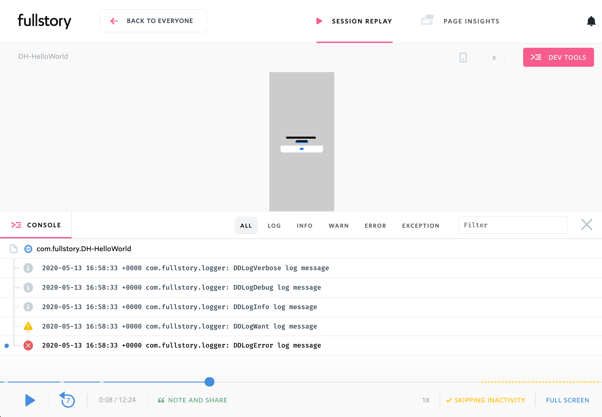
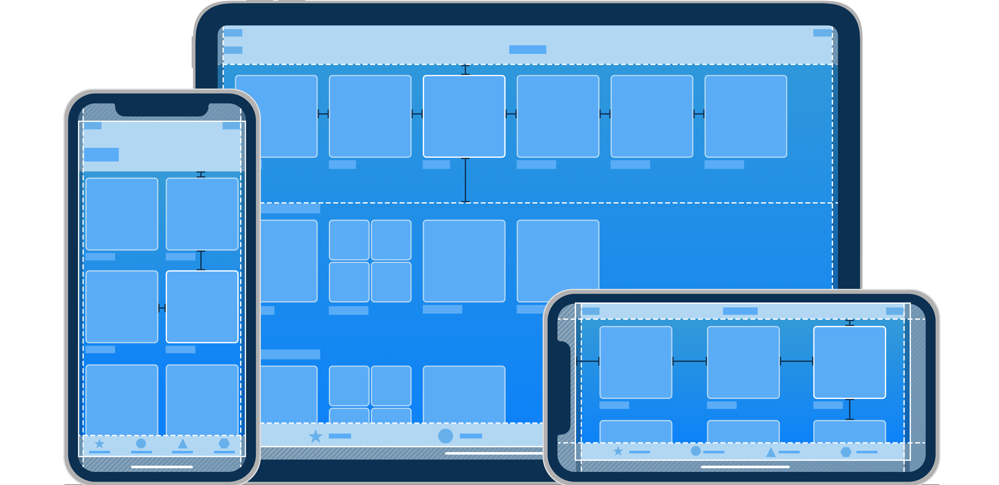

# ios-shoppe-demo
iOS Client for the example "Shoppe" app

The iOS Shoppe Demo is a reference application that provides tips and tricks to using [FullStory](https://www.fullstory.com/) on [Native Mobile](https://www.fullstory.com/mobile-apps/) iOS.

## Getting started

To apply the FullStory iOS Plugin, you'll need [Xcode](https://developer.apple.com/xcode). You'll then download or clone this repo to your desired directory.

To open the project, use "File > Open" in Xcode and select either "swift" or "Objective-C"(coming soon) folder.

## Adding FullStory to the app

If you have [signed up](https://www.fullstory.com/plans/) for FullStory, add the following to your `Info.plist`:
```
<key>FSOrgId</key>
  <string>YOUR_ORG_HERE</string>
```

Your orgId can be found on the _Settings_ page once you are logged in to FullStory.  It'll be next to the `window['_fs_org']` variable in the snippet.  For more information, see [Install your recording snippet](https://help.fullstory.com/hc/en-us/articles/360047075853).

For successful recording, please do not change the `server` value. It should always be `https://fullstory.com`.

For the complete guide on how to install FullStory visit [Getting Started with iOS Recording](https://help.fullstory.com/hc/en-us/articles/360042772333-Getting-Started-with-iOS-Recording)

## Using the app

The Shoppe is a super simple e-commerce application. Build and run the app on your emulator, you can:

- Browse a list of products int the _Market_.
- Use the **Add to Cart** button to add products to your shopping cart.
- Go to your _Shopping Cart_ by clicking on the cart icon on the top right corner.
- Review your cart and then click the **Checkout** button.
- Fill out the form on the _Checkout_ view and click **Purchase**. The app persists locally all the information from this view. Please do **not** use your real information.
- When clicking **Purchase** your information is validated and a Toast message will be shown. The purchase is successful if all fields passed the validate and your subtotal is greater than 0.

## API Usage Examples

`FullStoryManager.swift` (FSManager) is a file full of functions and enums that can make the FullStory API easier to apply to areas of your project. (Its an example of implementation for your app)

### Identifying a user:
- [Here](https://github.com/fullstorydev/ios-shoppe-demo/blob/c534166901d71f0dace44f85aee053242dd25caf/swift/ios-shoppe-demo/ServiceManagers/FullStoryManager.swift#L69) is how we can create an easily accessible method for FS identify.
```swift
func fsIdentify(id: String, userInfo: [String: Any]) {
    FS.identify(id, userVars: userInfo)
}
```

- [Here](https://github.com/fullstorydev/ios-shoppe-demo/blob/c534166901d71f0dace44f85aee053242dd25caf/swift/ios-shoppe-demo/Views/StoreViewController.swift#L42) is how we can use it.
```swift
fsIdentify(id: user.id.uuidString, userInfo: user.infoDict)
```

### Creating Events:
- [Here](https://github.com/fullstorydev/ios-shoppe-demo/blob/c534166901d71f0dace44f85aee053242dd25caf/swift/ios-shoppe-demo/ServiceManagers/FullStoryManager.swift#L38) is how we create events. We started with creating an enum that has the different events in the iOS app. (This could be different for you based on the flow of your app.)
```swift
enum Event: String {
    case browsing
    case itemSelected
    case viewCart
    case addToCart
    case checkout
    case removeFromCart
    case crash
}
```
- Then we create a convenience method that takes a case and a dictionary to title the event and provide properties.
```swift
func fsCreateEvent(event: Event, with dict: [String: Any]) {
    FS.event(event.rawValue, properties: dict)
}
```
- [Here](https://github.com/fullstorydev/ios-shoppe-demo/blob/c534166901d71f0dace44f85aee053242dd25caf/swift/ios-shoppe-demo/Views/CheckoutTableViewController.swift#L50) is how we create a custom event using the `fsCreateEvent` method.
```swift
fsCreateEvent(event: .checkout, with: order.orderSummary())
```

### Logging:
- We started by creating an enum:
```swift
enum LogLevel {
    case assert, error, warning, info, debug
}
```

- Then we follow up with a method that switches off of the log level [here](https://github.com/fullstorydev/ios-shoppe-demo/blob/c534166901d71f0dace44f85aee053242dd25caf/swift/ios-shoppe-demo/ServiceManagers/FullStoryManager.swift#L42).
```swift
func fsLog(message: String, level: LogLevel = .info) {
    var fsLogType: FSEventLogLevel

    switch level {
    case .assert:
        fsLogType = FSLOG_ASSERT
    case .error:
        fsLogType = FSLOG_ERROR
    case .warning:
        fsLogType = FSLOG_WARNING
    case .info:
        fsLogType = FSLOG_INFO
    case .debug:
        fsLogType = FSLOG_DEBUG
    }

    FS.log(with: fsLogType, message: "\(Date())" + message)
}
```
- [Here](https://github.com/fullstorydev/ios-shoppe-demo/blob/c534166901d71f0dace44f85aee053242dd25caf/swift/ios-shoppe-demo/Views/CheckoutTableViewController.swift#L56) is how we can use it to log.
```swift
fsLog(message: "User tried to checkout without confirmation.", level: .error)
```

Then the logs will show up the developer console:


## Privacy

- We for the hardcoded values that represent the privacy settings we have an example of more enum utilization [here](https://github.com/fullstorydev/ios-shoppe-demo/blob/c534166901d71f0dace44f85aee053242dd25caf/swift/ios-shoppe-demo/ServiceManagers/FullStoryManager.swift#L32).

```swift
enum PrivacySetting: String {
    case exclude = "fs-exclude"
    case mask = "fs-mask"
    case unmask = "fs-unmask"
}
```

- Then we created a method called `fsModifyPrivacy` [here](https://github.com/fullstorydev/ios-shoppe-demo/blob/c534166901d71f0dace44f85aee053242dd25caf/swift/ios-shoppe-demo/ServiceManagers/FullStoryManager.swift#L61):

```swift
func fsModifyPrivacy(setting: PrivacySetting, views: UIView?...) {
    views.forEach { view in
        if let view = view {
            FS.addClass(view, className: setting.rawValue)
        }
    }
}
```

- Then we use it:

  An example of making sure a view appears on FillStory with the `unmasking` setting can be found in [ProductCollectionViewCell](https://github.com/fullstorydev/ios-shoppe-demo/blob/c534166901d71f0dace44f85aee053242dd25caf/swift/ios-shoppe-demo/Views/ProductCollectionViewCell.swift#L29):

```swift
fsModifyPrivacy(setting: .unmask, views: self)
```

​		An example of making sure a view does not appears on FillStory with the  setting can be found in [ProductSummaryDetailCell](https://github.com/fullstorydev/ios-shoppe-demo/blob/c534166901d71f0dace44f85aee053242dd25caf/swift/ios-shoppe-demo/Views/ProductSummaryDetailCell.swift#L20):

```swift
fsLog(message: "User tried to checkout without confirmation.", level: .error)
```

## Using FullStory with the app

Now that you've used the app, you have a session in FullStory. Head on over to FullStory [https://app.fullstory.com/login](https://app.fullstory.com/login).

Make sure you background or kill your app. This ensures that FullStory receives a signal in order to start processing your session. This may take few minutes.

Then you can find your session by going to the mobile segment in FullStory, or build your own segment/search.

Check out a few sessions and explore the data to get a feel for how you'd use FullStory on your own app.

## App Architecture

This app was developed based on [Apple's Human Interface Guidlines](https://developer.apple.com/design/human-interface-guidelines/ios/overview/themes/)



## Tips and tricks

- Checkout our [Native Mobile Privacy Rules](https://help.fullstory.com/hc/en-us/articles/360043356573-Native-Mobile-Privacy-Rules).
- For step by step guide checkout: [Getting Started Guide](https://help.fullstory.com/hc/en-us/articles/360042772333-Getting-Started-with-iOS-Recording).
